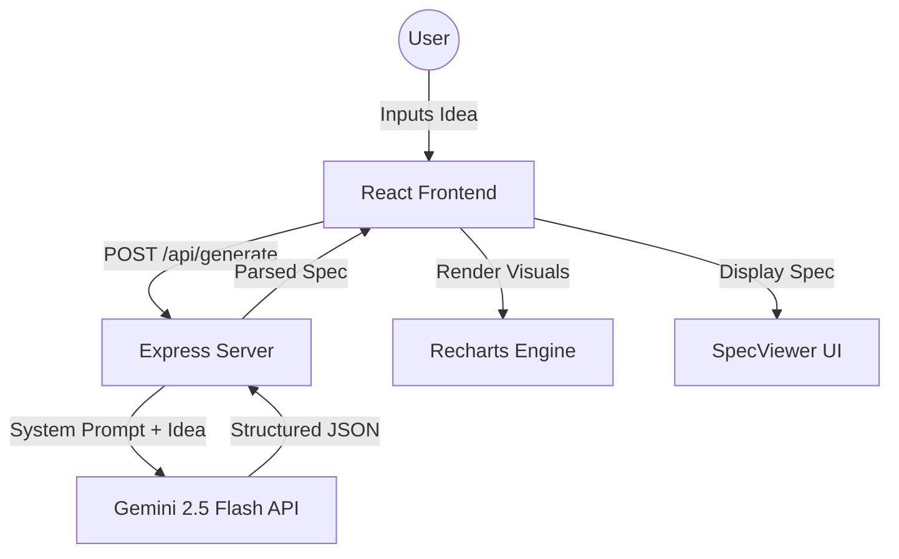

# ⚡ SpecForge: AI-Powered MVP Specification Engine

[](https://opensource.org/licenses/MIT)
[](https://react.dev/)
[](https://nodejs.org/)
[](https://deepmind.google/technologies/gemini/)

> **Transform raw startup ideas into production-ready MVP specifications in seconds.** SpecForge thinks like a YC founder, architects like a Staff Engineer, and budgets like a CFO.

---

## 🚀 Overview

**SpecForge** is an elite product strategy tool designed to bridge the gap between a "spark of an idea" and a "structured execution plan." It leverages Google's **Gemini 2.5 Flash** model to generate opinionated, data-driven, and highly specific specification documents that cover everything from technical architecture to 2024-market-rate cost estimates.

### Why SpecForge?
*   **Avoid "Generic AI" Fluff**: No more "implement a robust system." SpecForge provides specific library versions, implementation strategies, and real-world rationales.
*   **Financial Transparency**: Get realistic development budgets and monthly run rates based on 2024 freelancer rates and actual SaaS pricing.
*   **Visual Strategy**: Built-in charts for feature distribution, timeline planning, and risk assessment.

---

## ✨ Key Features

### 1. 🎯 Persona & Problem Mapping
SpecForge identifies specific user archetypes, their context, and their precise pain points. It builds a narrative around *who* suffers and *how* your MVP solves it.

### 2. 🏗️ Opinionated Tech Stack
For every recommendation, SpecForge explains:
*   **Why**: The strategic reason for choosing that specific tool over alternatives.
*   **How**: Exactly how it should be implemented within the codebase (e.g., "Use Next.js Server Components for SEO-critical landing pages").

### 3. 📊 MoSCoW Prioritization
Features are automatically categorized into:
*   **Must-Have**: The bare minimum to validate value.
*   **Should-Have**: Significant value but non-blocking.
*   **Could-Have**: Post-launch optimizations.

### 4. 💰 Financial & Timeline Projection
*   **Development Budget**: Detailed breakdown of hours and costs for frontend, backend, and integration.
*   **Monthly Run Rate**: Real-world costs for Vercel, Supabase, OpenAI API, etc., including free tier caveats.
*   **7-Day Sprint**: A concrete list of immediate actions to take right now.

---

## 🛠️ Tech Stack

### Frontend
- **React 19**: Modern UI with high-performance state management.
- **Recharts**: Beautiful SVG-based data visualizations.
- **Vite**: Ultra-fast build tool and dev server.
- **Vanilla CSS**: Premium, custom-tailored glassmorphic design system.

### Backend
- **Node.js & Express**: Lightweight, scalable REST API.
- **Gemini 2.5 Flash**: SOTA LLM for high-speed, high-token-window content generation.
- **Concurrently**: Unified development environment for one-command startup.

---

## 📐 System Architecture



---

## 📋 Schema Overview

SpecForge generates a massive, structured JSON object following this high-level schema:

| Section | Content |
| :--- | :--- |
| **Project Identity** | Name, Tagline, Problem Statement |
| **Market Analysis** | Target Personas, Competitors, Differentiators |
| **Product Spec** | MoSCoW Features, User Stories, Success Metrics |
| **Technical Spec** | Full Tech Stack (Frontend, Backend, DB, AI) |
| **Planning** | MVP Timeline, Risk Assessment (Severity/Mitigation) |
| **Financials** | Dev Budget, Monthly Ops Cost, Monetization Strategy |

---

## 🚦 Getting Started

### Prerequisites
- Node.js (v18+)
- A Gemini API Key ([Get it here](https://aistudio.google.com/app/apikey))

### Installation

1. **Clone the repository**
   ```bash
   git clone https://github.com/editorbymood/MVP.git
   cd MVP
   ```

2. **Install dependencies**
   ```bash
   npm install
   ```

3. **Configure Environment Variables**
   Create a `.env` file in the root directory:
   ```env
   PORT=3001
   GEMINI_API_KEY=your_actual_api_key_here
   ```

4. **Launch SpecForge**
   ```bash
   npm run dev
   ```
   *The server will start on `http://localhost:3001` and the frontend on `http://localhost:5173`.*

---

## 🛣️ Roadmap

- [ ] **Multi-Model Support**: Toggle between Gemini Pro and GPT-4o.
- [ ] **Export to PDF/DOCX**: Downloadable professional pitch decks.
- [ ] **GitHub Boilerplate Gen**: Automatically generate a `create-react-app` or `Next.js` structure based on the spec.
- [ ] **User Auth**: Save and share generated specifications.

---

## 📄 License

Distributed under the MIT License. See `LICENSE` for more information.

---

<p align="center">
  Built with ❤️ by <strong>Shanket</strong> @ <strong>editorbymood</strong>
</p>
